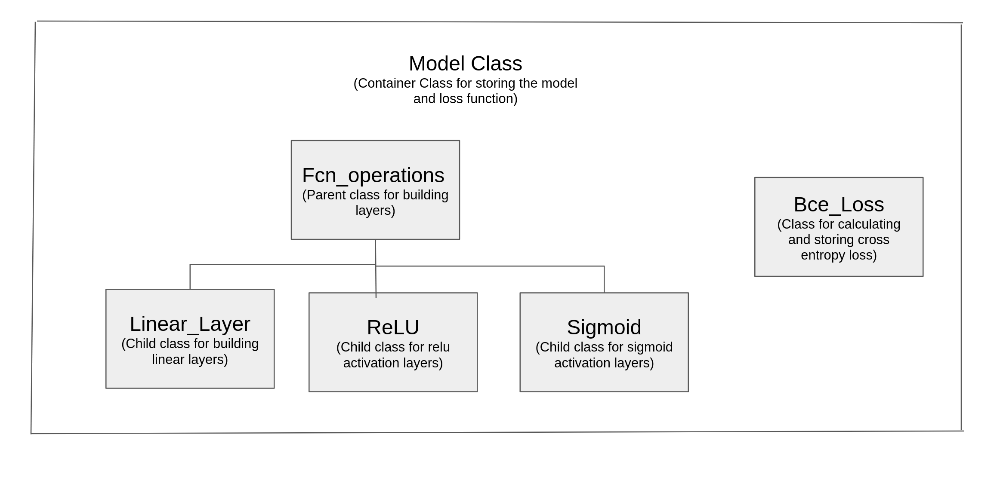

## CPP Based MLP

This is a C++ based implementation of Multilayered Perceptron(MLP). This repository uses Eigen for Matrix manipulations and linear algebra. This project is part of the C++ Nanodegree Capstone Project - Option 1. 

This code performs binary classification on datasets which are represented in a ".csv" format. A custum architecture can be built by using any combination of Linear Layers, ReLU and sigmoid activation functions with a BCE Loss function. Learning rate and number of epochs will be passed as inputs by the user. The training data is being normalized to improve performance of the model.The network architecture can be tuned by modifying the network definition in the model class. The network is currently being trained on the [Breast Cancer Dataset.](https://archive.ics.uci.edu/ml/datasets/Breast+Cancer+Wisconsin+%28Diagnostic%29)

When run using the default dataset and default architecture with a leraning rate equal to 0.001 you should acheive training accuracy ~ 0.9 and test accuracy ~ 0.92. 

## File Structure
* The src folder consists of the main file and implementation of various classes.
* The include folder consits of all the header files and class definitions. 

## Class Structure
* MLP related classes

* Read_csv class is used to read, store and perform manipulations on input data.

## Dependencies for Running Locally
* cmake >= 3.1
  * All OSes: [click here for installation instructions](https://cmake.org/install/)
* make >= 4.1 (Linux, Mac), 3.81 (Windows)
  * Linux: make is installed by default on most Linux distros
  * Mac: [install Xcode command line tools to get make](https://developer.apple.com/xcode/features/)
  * Windows: [Click here for installation instructions](http://gnuwin32.sourceforge.net/packages/make.htm)
* gcc/g++ >= 7.5.0
  * Linux: gcc / g++ is installed by default on most Linux distros
  * Mac: same deal as make - [install Xcode command line tools](https://developer.apple.com/xcode/features/)
  * Windows: recommend using [MinGW](http://www.mingw.org/)
* Eigen >= 3.3.7
  * Download the latest stable version - [Eigen](http://eigen.tuxfamily.org/index.php?title=Main_Page#Download)
  * Extract the zip file in your home directory and rename the folder to Eigen3.

## Basic Build Instructions
1. Clone this repo.
2. Make a build directory in the top level directory: `mkdir build`
3. Move the data folder to the build directory: `mv Breast_Cancer_Data build`
4. Compile: `cd build && cmake .. && make`
5. Run it: `./train`.
